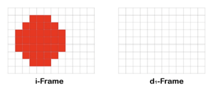

# Kontrollfragen zum Thema "Verlustbehaftete Bildkompression":
**Zeit: 9 Minuten**
1. Beansprucht ein Film in der grossen HD-Auflösung HD1080 mit 50 Halbbilder/sek. wesentlich mehr Speicherplatz als ein Film in der kleinen HD-AuflösungHD720 mit dafür 50 Vollbilder/sek.?
- _Ja, HD1080 hat eine höhere Auflösung und benötigt daher mehr Speicherplatz._
HD1080i50: 1080 * 1920 * 3 Byte * 25 =

2. Kann man durch die Bildumwandlung vom RGB- in den YCbCr-Farbraum bereits Speicherplatz einsparen?

- _Ja, da der YCbCr-Farbraum die Helligkeits- und Farbinformationen getrennt speichert und die menschliche Wahrnehmung weniger empfindlich für Farbdetails ist, kann dies zu einer 
Reduzierung der Datenmenge führen._

3. Berechnen sie für folgendes Subsamplingvarianten die Speichereinsparung in % gegenüber dem Original:  "4:4:4",  "4:2:2",  "4:1:1",  "4:2:0".

- _4:4:4 = 0%, 4:2:2 = 25%, 4:1:1 = 50%, 4:2:0 = 50%_

4. Warum verschlechtert sich die Bildschärfe von 4:1:1-Subsampling gegenüber 4:4:4-Subsampling nicht?

- _Weil die Bildschärfe hauptsächlich von der Helligkeitsinformation (Y) abhängt, die bei 4:1:1-Subsampling nicht reduziert wird. Die Farbinformationen (Cb und Cr) werden reduziert, was weniger Einfluss auf die wahrgenommene Schärfe hat._

5. Warum bilden sich bei der JPG-Bildkompression (DCT) bei sehr starker Komprimierung sogenannte Block-Artefakte?

- _Weil bei starker Komprimierung die DCT-Koeffizienten stark quantisiert werden, was zu sichtbaren Blöcken im Bild führt. Diese Block-Artefakte entstehen, weil die Frequenzinformationen in den 8x8-Pixel-Blöcken nicht mehr ausreichend differenziert sind und dadurch harte Kanten und Unschärfen entstehen._

6. Was versteht man unter der Bezeichnung GOP25?

- _Jedes 25. Bild ist ein komplettes Bild(I-Frame oder SChlüsselbild)
GOP25 bezeichnet eine Group of Pictures (GOP) Struktur, bei der 25 Bilder (Frames) in einer Sekunde verarbeitet werden. Dies ist typisch für Videoformate mit 25 Bildern pro Sekunde._

7. A: In einer Heimatkundefilm-Sequenz wurde die unbewegte Kamera 20 Sekunden lang auf  einen Kirchturm gerichtet.

    B: In einer Tierfilm-Sequenz verfolgt eine Handkamera aus einem bewegten Fahrzeug heraus 20 Sekunden lang einen Leoparden bei der Jagd.Welche der beiden Szenen A oder B bietet mehr Potential für eine speichersparende "Interframe Komprimierung"?

    - _Szene A bietet mehr Potential für eine speichersparende "Interframe Komprimierung", da die Kamera unbewegt ist und sich der Hintergrund nicht ändert. In Szene B hingegen gibt es viele Bewegungen und Veränderungen, die mehr Daten erfordern._

8. Das Bild zeigt die GOP-Sequenz eines roten, wandernden Punktes. Pro Frame verschiebt sich der Punkt um eine Pixelstelle nach rechts.Zeichnen sie das erste Differenzbild.Rot: Pixel, das von Weiss auf  Rot wechseln.Weiss: Pixel, das von Rot auf  Weiss wechselt.Schwarz: Unveränderte Pixel.



🟥 = Neuer roter Pixel
⬜ = Verschwundener roter Pixel
⬛ = Unveränderter Pixel


```
⬛⬛⬛⬛⬛⬛⬛⬛⬛⬛⬛⬛
⬛⬛⬛⬜⬛⬛🟥⬛⬛⬛⬛⬛
⬛⬛⬜⬛⬛⬛⬛🟥⬛⬛⬛⬛
⬛⬜⬛⬛⬛⬛⬛⬛🟥⬛⬛⬛
⬛⬜⬛⬛⬛⬛⬛⬛🟥⬛⬛⬛
⬛⬜⬛⬛⬛⬛⬛⬛🟥⬛⬛⬛
⬛⬛⬜⬛⬛⬛⬛🟥⬛⬛⬛⬛
⬛⬛⬛⬜⬛⬛🟥⬛⬛⬛⬛⬛
⬛⬛⬛⬛⬛⬛⬛⬛⬛⬛⬛⬛```